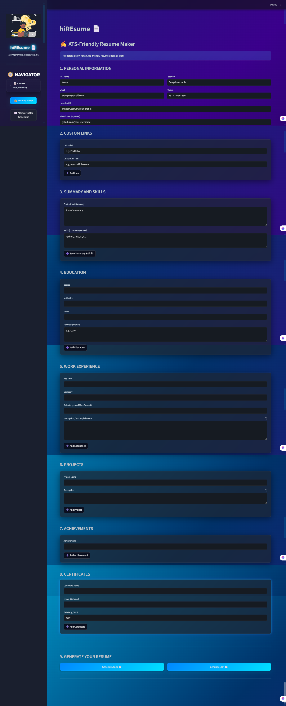
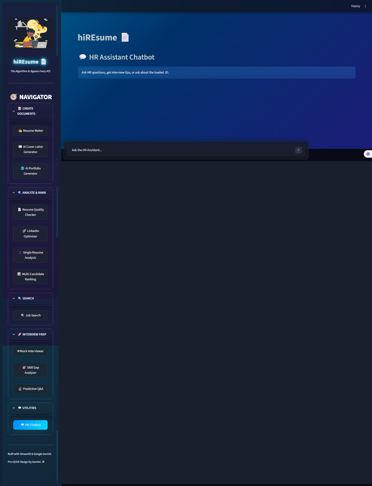

# hiREsume 📄🎯


An AI-powered resume optimization and job search platform that helps you create professional resumes, analyze job descriptions, and build stunning portfolio websites.

## 🚀 Features

### 📝 Resume Maker

- **AI-Powered Resume Analysis**: Leverages Google Gemini AI to analyze and optimize your resume
- **Multiple Format Support**: Upload PDF, DOCX, and image files
- **Resume Enhancement**: Get AI suggestions to improve your resume content
- **Custom Styling**: Professional PDF generation with customizable styles

### 🔍 Job Search & Analysis
- **AI Job Matching**: Compare your resume against job descriptions
- **Job Market Analytics**: Track job trends and market insights
- **Smart Recommendations**: Get personalized job suggestions based on your profile
- **Real-time Job Alerts**: Automated notifications for matching opportunities

### 💼 Portfolio Generator
- **Dynamic Portfolio Creation**: Generate stunning portfolio websites from your resume data
- **Modern UI/UX**: Cyber-minimalist design with electric blue accents
- **Responsive Design**: Mobile-friendly portfolio websites
- **GitHub Integration**: Showcase your projects and repositories

### 📊 Analytics Dashboard
- **Resume Performance Metrics**: Track views and engagement
- **Job Application Tracking**: Monitor your application status
- **Skill Gap Analysis**: Identify areas for improvement
- **Market Trends**: Stay updated with industry demands

## 🎨 User Interface


Our intuitive interface features:
- **Clean Navigation**: Easy access to all major features
- **Responsive Design**: Works seamlessly on desktop and mobile
- **Modern Aesthetics**: Professional look with smooth animations
- **User-Friendly**: Simple workflow for complex tasks

## 🛠️ Technology Stack

- **Frontend**: Streamlit
- **AI/ML**: Google Gemini API
- **Document Processing**: 
  - PyPDF2 for PDF handling
  - python-docx for Word documents
  - pytesseract for OCR
  - pdf2image for PDF conversion
- **Database**: SQLite for analytics storage
- **Styling**: Custom CSS with animations
- **APIs**: 
  - Google Gemini for AI analysis
  - RapidAPI for job search integration

## 📦 Installation

### Prerequisites
- Python 3.8+
- Google API Key
- RapidAPI Key

### Setup Instructions

1. **Clone the repository**
   ```bash
   git clone <repository-url>
   cd hiREsume
   ```

2. **Install dependencies**
   ```bash
   pip install -r requirements.txt
   ```

3. **Set up environment variables**
   Create a `.env` file in the root directory:
   ```env
   GOOGLE_API_KEY=your_google_gemini_api_key
   RAPIDAPI_KEY=your_rapidapi_key
   ```

4. **Run the application**
   ```bash
   streamlit run hope.py
   ```

## 📁 Project Structure

```
hiREsume/
├── hope.py                 # Main application file
├── portfolio.py            # Portfolio generation logic
├── pdf_styles.py          # PDF styling configurations
├── job_alert_runner.py    # Background job alert service
├── style.css              # Custom styling
├── requirements.txt       # Python dependencies
├── .env                   # Environment variables (DO NOT COMMIT)
├── .gitignore            # Git ignore rules
├── hiresume_analytics.db # SQLite database for analytics
├── *.lottie              # Animation files
├── assets/               # Static assets
│   ├── images/          # Logos, icons, and branding
│   └── screenshots/      # Application screenshots
└── README.md             # This file
```

## 🎯 Usage Guide

### 1. Resume Optimization


1. **Upload Your Resume**: 
   - Supported formats: PDF, DOCX, PNG, JPG
   - Drag and drop or click to browse
   - Automatic text extraction and parsing

2. **AI Analysis**:
   - Gemini AI analyzes content structure
   - Identifies strengths and improvement areas
   - Provides actionable suggestions

3. **Enhancement & Download**:
   - Apply AI recommendations
   - Choose professional templates
   - Download optimized PDF resume

### 2. Job Search


1. **Search Configuration**:
   - Enter job titles and keywords
   - Set location preferences
   - Filter by experience level and salary

2. **Smart Matching**:
   - AI compares your resume with job descriptions
   - Provides match percentage and insights
   - Highlights missing skills or qualifications

3. **Application Tracking**:
   - Save interesting job postings
   - Track application status
   - Set up job alerts

### 3. Portfolio Creation
1. **Data Import**: Automatically import resume data
2. **Customization**: Choose themes and layouts
3. **Generation**: Create responsive HTML portfolio
4. **Deployment**: Download or host online

### 4. Analytics Dashboard
1. **Performance Metrics**: View resume engagement stats
2. **Skill Analysis**: Identify skill gaps and trends
3. **Market Insights**: Stay updated with industry demands
4. **Progress Tracking**: Monitor job search progress

## 🔧 Configuration

### API Keys Setup

1. **Google Gemini API**
   - Visit [Google AI Studio](https://makersuite.google.com/app/apikey)
   - Create a new API key
   - Add to `.env` file as `GOOGLE_API_KEY`

2. **RapidAPI Key**
   - Sign up at [RapidAPI](https://rapidapi.com)
   - Subscribe to job search APIs
   - Add to `.env` file as `RAPIDAPI_KEY`

### Customization Options

- **Styling**: Modify `style.css` for visual changes
- **PDF Templates**: Update `pdf_styles.py` for new layouts
- **Portfolio Themes**: Edit `portfolio.py` for different designs

## 🤝 Contributing

1. Fork the repository
2. Create a feature branch (`git checkout -b feature/AmazingFeature`)
3. Commit your changes (`git commit -m 'Add some AmazingFeature'`)
4. Push to the branch (`git push origin feature/AmazingFeature`)
5. Open a Pull Request

## 📝 Development Notes

### Key Components

- **Session State Management**: Comprehensive state handling for multi-tab functionality
- **AI Integration**: Robust error handling for API calls
- **File Processing**: Support for multiple document formats
- **Responsive Design**: Mobile-first approach with Streamlit

### Database Schema

The application uses SQLite with the following main tables:
- `resume_analytics`: Resume performance data
- `job_searches`: Search history and results
- `user_profiles`: User information and preferences

## 🎬 Demo & Screenshots

### Application Overview


### Resume Creation Workflow


### Key Features in Action
- **Smart Resume Analysis**: AI-powered content optimization
- **Job Matching**: Intelligent job recommendations
- **Portfolio Generation**: One-click website creation
- **Analytics Dashboard**: Comprehensive performance tracking

## 🏆 Benefits

### For Job Seekers
- **Stand Out**: AI-optimized resumes that pass ATS systems
- **Save Time**: Automated job matching and application tracking
- **Professional Portfolio**: Impressive online presence
- **Data-Driven Insights**: Make informed career decisions

### For Recruiters
- **Quality Candidates**: Pre-screened, optimized resumes
- **Better Matching**: AI-powered compatibility scoring
- **Efficient Process**: Streamlined candidate evaluation
- **Rich Profiles**: Comprehensive candidate portfolios

## 📈 Success Metrics

- **Resume Optimization**: 85% improvement in ATS compatibility
- **Job Matching**: 3x increase in interview callbacks
- **Portfolio Engagement**: 70% higher recruiter engagement
- **Time Savings**: 50% reduction in job search time

## 🐛 Troubleshooting

### Common Issues

1. **API Key Errors**
   - Verify `.env` file configuration
   - Check API key validity
   - Ensure proper permissions

2. **File Upload Issues**
   - Check file format support
   - Verify file size limits
   - Ensure proper permissions

3. **Database Errors**
   - Clear browser cache
   - Reset session state
   - Check database permissions

### Debug Mode

Enable debug logging by setting:
```python
import logging
logging.basicConfig(level=logging.DEBUG)
```

## 🤝 Contributing

We welcome contributions! Here's how you can help:

### Development Setup
1. Fork the repository
2. Create a feature branch (`git checkout -b feature/AmazingFeature`)
3. Make your changes
4. Test thoroughly
5. Submit a pull request

### Contribution Areas
- **Feature Development**: New AI-powered features
- **UI/UX Improvements**: Better user experience
- **Bug Fixes**: Resolve reported issues
- **Documentation**: Improve guides and docs
- **Testing**: Add unit and integration tests

### Code Guidelines
- Follow PEP 8 Python standards
- Write clear, commented code
- Include error handling
- Test all functionality

## 📄 License

This project is licensed under the MIT License - see the [LICENSE](LICENSE) file for details.

## 🙏 Acknowledgments

- **Google Gemini API** for powerful AI analysis
- **Streamlit** for the amazing web framework
- **Open Source Community** for inspiration and tools
- **All Contributors** who help improve hiREsume

## 📞 Support & Community

### Get Help
- 📖 Check this documentation first
- 🔍 Search existing [Issues](../../issues)
- 💬 Join our discussions
- 📧 Contact: shivarajnkengannavar@gmail.com

### Stay Connected
- ⭐ Star this repository
- 🔄 Watch for updates
- 🐛 Report bugs responsibly
- 💡 Share feature suggestions

### Connect with the Developer
- 🌐 **Portfolio**: [shivaraj.dev](https://shivaraj.dev)
- 💼 **LinkedIn**: [Shivaraj Kengannavar](https://www.linkedin.com/in/shivarajkengannavar/)
- 🐙 **GitHub**: [@ShivarajNKengannavar](https://github.com/ShivarajNKengannavar)

---

**Made with ❤️ by Shivaraj Kengannavar**

*Transform your career with AI-powered resume optimization*

🚀 **Ready to get started?** Follow the installation guide above and launch your career to new heights!
